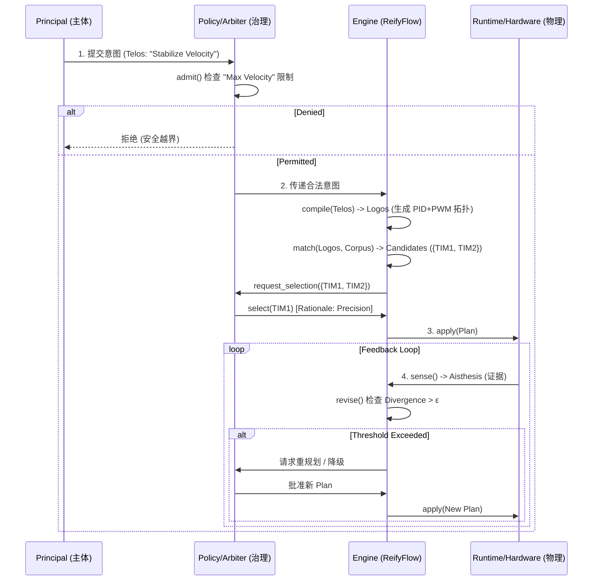

# ReifyFlow Protocol

-----

# 📐 ReifyFlow Structural Logic Framework

**(ReifyFlow 结构逻辑框架)**

> **Version:** 1.3 (Refined Ontology & Mapping)
> **Type:** Abstract Specification
> **Scope:** Ontology, Axioms, and Operator Semantics

-----

## 1. 定位与范围 (Positioning & Scope)

### 1.1 目标

本框架旨在定义一种通用的**显化逻辑 (Manifestation Logic)**。它描述了来自**可能相互约束或竞争的多主体意图**，如何在治理规则与物理约束的边界内，经过可审计的**编译、选择与证据更新**，转化为安全的物理执行。

### 1.2 范围

  * **包含 (Normative):** 核心本体定义、类型系统、公理集、抽象操作符签名、系统性质与合规准则。
  * **排除 (Non-Normative):** 具体序列化格式 (JSON/XML)、编程语言、求解算法、硬件架构或特定供应商实现。

-----

## 2. 核心本体 (Core Ontology)

系统由六类基础实体构成，涵盖存在的四个维度与治理结构。

### 2.1 Telos (Intent / 意图)

  * **定义:** 规范性声明 (Normative Statement)，定义“应当发生”的状态或效果。**严禁包含任何关于“如何实现”的技术细节。**
  * **属性:** 目标状态 (Goal State)、作用域 (Scope)、期限 (TTL)、优先级 (Priority)。
  * **约束:** 分为 **Hard Invariants** (硬不变式) 与 **Soft Preferences** (软偏好)。
  * **元数据:** 必须包含主体溯源 (Provenance) 与正当性签名。

### 2.2 Logos (Virtual / 逻辑)

  * **定义:** 实现意图的抽象拓扑 (Abstract Topology)，承载“如何发生”的因果控制结构。
  * **属性:** 类型化接口、因果依赖关系、无物理时间的逻辑相位。
  * **构成:** 算法节点、数据流、事件流与控制流的有向图。

### 2.3 Corpus (Physical / 容器)

  * **定义:** 可执行的能力与边界 (Capabilities & Boundaries)。
  * **属性:** 提供的操作原语 (Provides)、刚性物理约束 (Constraints)、健康度 (Health)。
  * **性质:** 排他性 (Exclusive) 与资源预算 (Budget)。

### 2.4 Aisthesis (Feedback / 感知)

  * **定义:** 来自现实的证据 (Evidence)，作为更新系统状态的唯一真理来源。
  * **属性:** 带有单位与量纲的遥测值、物理事件、不可逆的熵增记录。
  * **核心度量:** **散度 (Divergence)** —— 观测值与规范目标之间的距离。

### 2.5 Policy (Governance / 策略)

  * **定义:** 许可与约束的规范性集合。
  * **职责:** 定义准入标准 (Admission Criteria) 与系统边界 (System Boundaries)。

### 2.6 Arbiter (Arbitration / 仲裁者)

  * **定义:** 在候选集上施加选择策略的实体。
  * **职责:** 在可行解集中执行偏序/词典序选择，处理平局，或触发外部（人类）介入。

-----

## 3. 类型与关系 (Types & Relations)

### 3.1 基本类型

  * **Node:** $Entity \in \{Telos, Logos, Corpus, Aisthesis, Policy, Arbiter\}$
  * **Edge:** 有向关系，必须符合以下**允许端点对 (Allowed Endpoints)**：
      * $Requires$: $Telos \to Logos$ (需求实现) 或 $Logos \to Corpus$ (需求资源)。
      * $Provides$: $Corpus \to Logos$ (提供能力)。
      * $Governed\_By$: $\{Telos, Logos, Corpus\} \to Policy$ (受控于)。
      * $Conflicts\_With$: $Telos \leftrightarrow Telos$ 或 $Logos \leftrightarrow Logos$ (互斥)。
      * $Flows\_To(kind)$: $Logos \to Logos$ (逻辑流，$kind \in \{Data, Event, Control\}$)。
  * **Metric:**
      * $R$: 抽象风险度量 (Abstract Risk Metric)，定义在 $Plan$ 集合上的偏序关系。
      * $\epsilon$: 散度阈值 (Divergence Threshold)，由 $Policy$ 或 $Telos$ 定义。
  * **Constraint:**
      * $\forall h \in Hard$: 必须满足 (Must Satisfy)。
      * $\forall s \in Soft$: 尽力优化 (Optimize)。
  * **Provenance:** $\{Principal, Scope, Timestamp, Signature\}$。

### 3.2 组合性质

  * **组合性 (Compositionality):** 若图 $G_1$ 和 $G_2$ 是类型安全的，则 $G_1 \cup G_2$ 在满足约束 $C$ 下也是类型安全的。
  * **组合保序 (Order Preservation):** 若两个子图各自满足 Hard 约束且不引入互斥资源冲突，则其组合在相同 Policy 下仍满足 Hard 约束。
  * **量纲一致性 (Dimensional Consistency):** 所有边两端的 Metric 必须具有兼容的物理量纲。

-----

## 4. 公理系统 (Axiomatic System)

系统行为必须满足以下八条公理：

  * **A1 意图规范性 (Normativity):** $Telos$ 仅定义“应当发生”的状态（What），不涉及“如何发生”的过程（How）。
  * **A2 安全优先 (Safety Precedence):** 选择遵循**词典序偏序**：$Hard$ 不变式优先于任何 $Soft$ 目标或最优性。
  * **A3 坍缩即选择 (Collapse as Selection):** 显化过程是在满足所有硬约束的可行解集中，应用选择函数。
  * **A4 反馈即证据 (Feedback as Evidence):** $Aisthesis$ 是更新 $Corpus$ 状态与 $Logos$ 参数的唯一真理来源。
  * **A5 治理即许可 (Governance as Permission):** 只有通过 $Policy$ 验证的 $Telos$ 才能进入求解空间。
  * **A6 结构即法律 (Structure is Law):** 未在 $Corpus$ 描述文件中定义的能力，在逻辑上不可达。
  * **A7 可审计性 (Auditability):** 系统的每一次状态变更（$S_t \to S_{t+1}$）都必须产生不可篡改的证据链（Trace）。
  * **A8 单调安全性 (Monotonic Safety):** 当约束收紧时，系统不得选择在抽象风险度量 $R$ 下更劣的计划；必须存在安全回滚点。

-----

## 5. 抽象操作符 (Abstract Operators)

定义系统的状态转移函数。

### 5.1 准入 (Admit)

  * **Signature:** $admit(Telos, Policy) \to \{Permit \mid Deny \mid Degrade \mid RequireApproval\}, Reason$
  * **Properties:**
      * **完备性:** 所有 $Telos$ 必须经过此函数。
      * **阻断性:** 若 $Telos$ 越权或违反硬不变式，必须返回 $Deny$ 或 $RequireApproval$。

### 5.2 编译 (Compile)

  * **Signature:** $compile(Telos) \to Logos$
  * **Properties:**
      * **Projection:** 将纯粹的“意图”翻译为无物理绑定的“抽象控制拓扑”。
      * **Validity:** 输出的 $Logos$ 必须是图论上连通且类型正确的。

### 5.3 匹配 (Match)

  * **Signature:** $match(Logos, Corpus) \to \{CandidateSet, ConflictsCore\}$
  * **Properties:**
      * **Soundness (可靠性):** $CandidateSet$ 中的每个元素都满足所有 Hard 约束。
      * **Minimality (最小性):** $ConflictsCore$ 为最小不可满足集，不存在真子集仍不可满足。

### 5.4 选择 (Select)

  * **Signature:** $select(CandidateSet, Arbiter) \to \{Plan \mid OrderedPlanSet\}, Rationale$
  * **Properties:**
      * **Determinism:** 若 $Arbiter$ 策略完全指定，输出唯一 Plan；否则返回有序集合并记录打平逻辑。
      * **Explainability:** $Rationale$ 必须包含代价函数的值与权衡逻辑。

### 5.5 执行 (Apply)

  * **Signature:** $apply(Plan, Runtime) \to \{Ack, RollbackToken\}$
  * **Properties:**
      * **Idempotency (幂等性):** 重复应用同一 $Plan$ 不改变系统最终状态。
      * **Atomicity (原子性):** 执行要么完全成功，要么完全回滚。

### 5.6 感知 (Sense)

  * **Signature:** $sense(Runtime) \to Aisthesis(Telemetry, Divergence, Freshness)$
  * **Properties:**
      * **Expiration:** 过期证据不得用于提升能力边界。
      * **Alignment:** 散度必须基于 $Telos$ 的目标函数计算。

### 5.7 修正 (Revise)

  * **Signature:** $revise(Plan, Aisthesis) \to \{Plan' \mid Degrade \mid RequestArbitration\}$
  * **Properties:**
      * **Reactive:** 当 $Divergence > \epsilon$ （$\epsilon$ 由 Policy/Telos 定义）或证据过期时触发。
      * **Convergence (Weak):** 在约束稳定且散度有界的前提下，有限次调用将进入稳定状态或明确降级。

-----

## 6. 保证与非目标 (Guarantees & Non-Goals)

### 6.1 系统保证

1.  **Safety (安全性):** 以硬不变式为最高目标，甚至优于系统的活性 (Liveness)。
2.  **Auditability (可审计性):** 所有选择与审批均可追溯。
3.  **Type Safety (类型安全):** 不会发生量纲不匹配的连接。

### 6.2 非目标

1.  **Global Optimality (全局最优):** 系统只保证在给定偏好下的可解释权衡。
2.  **Implementation Specifics (特定实现):** 不规定具体的求解器算法或数据格式。

-----

## 7. 合规判据 (Compliance Criteria)

任何声称符合 **ReifyFlow 架构** 的实现，必须满足：

1.  **操作符完备:** 必须实现上述 7 个抽象操作符（含 Compile）。
2.  **证据链生成:** 每次操作必须产出结构化的证据对象，包含原因、约束引用与选择理由。
3.  **治理前置:** 必须在编译与匹配之前执行准入（Admit）。
4.  **闭环修正:** 必须具备基于 Aisthesis 的自动修正或降级机制。

-----

## 附录 A：嵌入式应用场景映射 (Abstract Mapping)

*(Informative Only - Refined for Pure Intent & Separation of Concerns)*

此表展示了 **Telos (纯意图)** 如何在不涉及 **Corpus (硬件)** 细节的情况下，经由 **Logos (控制逻辑)** 进行转化。

| 抽象实体 / 操作符 | 嵌入式实现映射 | 示例数据 / 行为 | 解释 |
| :--- | :--- | :--- | :--- |
| **Telos (意图)** | 规范性目标描述 | `Effect: "Stabilize_Velocity", Target: "Axis_Z", Setpoint: 100_RPM` | **纯意图**：只描述“要什么效果”，不关心是用 PWM 还是 DAC，也不涉及引脚号。 |
| **Logos (逻辑)** | 控制算法拓扑 | `PID_Controller -> PWM_Generator(Freq=20k) -> H_Bridge_Logic` | **纯逻辑**：Compile 阶段决定使用“PID+PWM驱动H桥”的机制来实现该意图。 |
| **Corpus (容器)** | 硬件描述与约束 | `TIM1 (Advanced), TIM2 (General); Pin_PA8 maps_to TIM1_CH1` | **纯物理**：提供具体的定时器资源、物理引脚映射表及电气特性。 |
| **Policy (策略)** | 安全边界 | `Hard: "Max_RPM <= 120", "Max_Current <= 2A"` | 治理层，防止意图造成的物理越界。 |
| **Op: admit** | 合规检查 | 检查 `Setpoint(100) <= Max(120)`? $\to$ **Permit** | 在计算任何逻辑之前，先检查意图本身的合法性。 |
| **Op: compile**| 意图翻译 | 解析 "Velocity Control" $\to$ 实例化 `PID + PWM` 抽象拓扑 | 将物理无关的意图转化为通用的技术实现路径。 |
| **Op: match** | 资源绑定 | `PWM_Gen` 需要 Timer $\to$ **Candidate: {TIM1, TIM2}** | 在硬件库中寻找能承载 PWM 逻辑节点的物理资源。 |
| **Op: select** | 权衡仲裁 | `Telos` 偏好“高精度” $\to$ 选 **TIM1** (16-bit) | 根据意图的 Soft 偏好，在候选硬件中做出最优选择。 |
| **Op: apply** | 部署执行 | 生成寄存器配置 `TIM1->CCR1 = ...` | 最终的物理显化。 |
| **Op: sense** | 散度测量 | 编码器反馈 98 RPM $\to$ **Divergence = 2 RPM** | 测量现实物理量与意图设定值之间的差距。 |

-----

## 附录 B：标准工作流时序 (Standard Workflow Sequence)

**End of Framework Definition.**

*Created for ReifyFlow.*